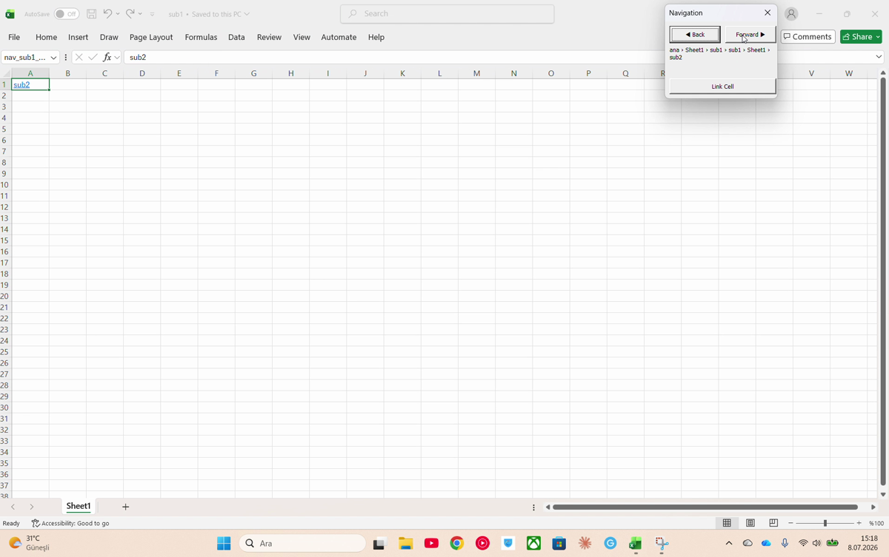

# 🧭 Excel Navigator

**Browse between separate Excel files like web pages — Back, Forward, and a live breadcrumb, right inside Excel.**


_Developed by **Ahmet Zan**_

Big projects often get split across **many separate `.xlsm` files**. Jumping between them means
digging through folders and losing your place. **Excel Navigator** adds a small floating panel to
every file so you can move around like a browser: click **Forward** to drill into a linked file
(the parent closes, so only one window stays open), click **Back** to return, and read a live
`File › Sheet › Cell` path that always shows where you are.

You build the links **visually** by clicking a cell and pressing **Link Cell** — no config files,
no macros to write. One `INSTALL.cmd` sets everything up in a single click.

> _Add a screenshot here: put an image at `docs/screenshot.png` and it will show below._
> <!--  -->

---

## ✨ Features

- 🪟 **Floating, draggable panel** — remembers its position, stays inside the Excel window
- ⬅️ **Back / Forward** navigation with full history
- 🧵 **Live breadcrumb** — `File › Sheet › Cell`, updated as you move
- 🖱️ **Visual "Link Cell" wizard** — click a cell, pick a target file & sheet, done
- 🔗 **Relative paths** — move or share the whole folder, links keep working
- ⚡ **One-click `INSTALL.cmd`** — installs into every file **and** turns on the auto-watcher
- 👀 **Auto-watcher** — drop a new `.xlsx` in the folder and it becomes a fully set-up `.xlsm`
  by itself within ~2 seconds (background, ~0% CPU)
- 🧩 **No dependencies** — plain Windows PowerShell + VBA. **No Python, no add-ins.**

## 📦 What's inside

```
INSTALL.cmd     ← the one file you double-click
LICENSE
system/         ← everything else (scripts + guides)
    kur.ps1                 installer  (-Folder for a folder, -File for one file)
    modNavigasyon.bas       the VBA navigation module
    excel_watcher.ps1       auto-watcher (converts + installs new files)
    launcher.vbs            starts the watcher invisibly
    watcher_setup.ps1 / watcher_remove.ps1
    START_WATCHER.cmd / STOP_WATCHER.cmd
    HOW_TO_INSTALL.txt      full setup guide
    USAGE.txt               short guide for end users
```

## 🚀 Quick start

1. **Download** this repo (green **Code ▸ Download ZIP**) and unzip it.
2. Copy **`INSTALL.cmd`** and the **`system`** folder into the folder that holds your Excel files.
3. Do the **two one-time Excel settings** (details in [`system/HOW_TO_INSTALL.txt`](system/HOW_TO_INSTALL.txt)):
   - **Enable VBA access** — Trust Center ▸ Macro Settings ▸ *Trust access to the VBA project
     object model*. _(So the installer can inject the panel.)_
   - **Make the folder a Trusted Location** — Trust Center ▸ Trusted Locations ▸ *Add new location*.
     _(So the panel actually appears — Excel blocks macros on new files otherwise.)_
4. **Double-click `INSTALL.cmd`.** It converts your `.xlsx` files to `.xlsm`, installs the panel,
   and starts the auto-watcher. Done.
5. Open your main file → click **Link Cell** to build your menu.

## 🧭 Building your menu

Select a cell → **Link Cell** → pick the target file (and sheet) → the cell turns into a blue link.
Make the **first** link from your main file so it's marked as the "home" file. A `nav_map.txt` is
created automatically — you never edit it by hand. To go: select a link, click **Forward**.

## 🔁 The auto-watcher

Turned on by `INSTALL.cmd`. It watches your project folder in the background (starting itself at
every logon) and turns any dropped `.xlsx` into a ready-to-use `.xlsm`.
Turn it off with `system/STOP_WATCHER.cmd`, back on with `system/START_WATCHER.cmd`.
Prefer not to run anything in the background? Just double-click `INSTALL.cmd` again whenever you
add files — it only sets up the new ones.

## ✅ Requirements

- Windows + desktop **Microsoft Excel** (Office). Partial on Mac.
- **Windows PowerShell** (built in). No Python, no installs.
- The two one-time Excel settings above (only on the machine that installs; people you _send the
  finished files to_ just need macros enabled).

## 🛠️ Troubleshooting

| Symptom | Fix |
|--------|-----|
| `Cannot access the VBA project` | Enable VBA access (Quick start step 3), run again |
| Converts but **no panel** shows | Make the folder a Trusted Location, or click **Enable Content** |
| `Subscript out of range` / file locked | Close Excel; avoid OneDrive "online-only" — use a local folder |
| New file not converted | The watcher isn't running — double-click `INSTALL.cmd` again |

More detail in [`system/HOW_TO_INSTALL.txt`](system/HOW_TO_INSTALL.txt).

## 📄 License

[MIT](LICENSE) © Ahmet Zan
